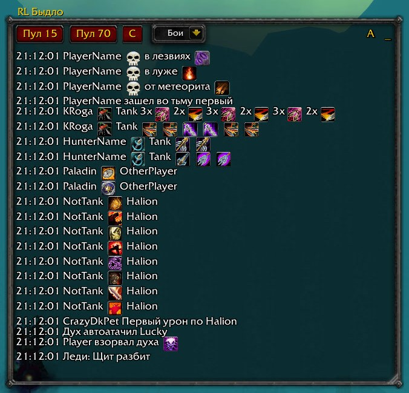

# RL Helper

Аддон для World of Warcraft 3.3.5a, помогающий рейд лидерам управлять рейдом.

Разработка и дебаг ведется на EzWOW и возможно какие-то правила не будут рабоать на других серверах. 
Что-то не работает как ожидалось или есть идеи - чирканите в [Issues](https://github.com/atorian/raid-leader-helper/issues).

## Зачем?

Чтобы эффективно проходить рейды нужно четко выполнять тактику. Бывает что игроки косячат, а бывает что намеренно руинят рейды, портя жизнь другим. Этот аддон нужен тем, кто не хочет тратить много времени на поиск проблемы.

## Возможности

- Визуальный лог текущего боя который не пропадет вместе с сообщениями в чате
- Отслеживание напулов
- Отслеживание нарушений тактики (взывы духов, несоблюдение дистанции, фридомы, диспелы, БР и тп)
- Быстры доступ к кнопкам РЧ, Пула и Отмены
- Быстры доступ к кнопкам ГП

## Установка

1. [Скачайте аддон](https://github.com/atorian/raid-leader-helper/releases)
2. Распакуйте в папку `World of Warcraft/Interface/AddOns`
3. Перезапустите игру

## Использование

- `/rlh` - показать/скрыть главное окно
- `/rlh help` - показать список команд

### Перенос настроек между аккаунтами

1. Откройте настройки RL Helper правым кликом по кнопке у миникарты.
2. В разделе «Перенос настроек аккаунта» нажмите «Экспорт» и скопируйте выделенную строку через Ctrl+C.
3. На другом аккаунте вставьте строку в такое же поле через Ctrl+V и нажмите «Импорт».

Импорт заменяет общие настройки всех персонажей принимающего аккаунта и применяется сразу.
Переносятся оформление и положение окна, сообщения, переключатели, причины GP и настройки ЕП
(время РТ, суммы, напоминания, источник DPS и пороги по специализациям).
История боёв, выполненные начисления ЕП и результаты DPS Саурфанга остаются у своего персонажа.
При неверном формате или недопустимых значениях настройки не изменяются.
Для переноса используйте одинаковую версию аддона на обоих аккаунтах.

### Структурированная история V2

Структурированный журнал включён всегда; переключателя версий нет.

- История хранится в `db.char.combatHistoryV2`. При загрузке устаревшая история
  всех персонажей и настройки выбора версии удаляются; структурированная история
  сохраняется. `/rlh clear` очищает историю текущего персонажа.
- V2 сохраняет до 30 завершённых боёв, до 20 000 событий в каждом.
  При достижении лимита событий журнал показывает предупреждение о неполных данных.
- Категория записи `type`: `INFO` или `TACTIC_VIOLATION`. В «Все» нарушения выделяются
  тёмно-красной подложкой; в «Ошибки» текст белый, имена сохраняют цвет класса. `kind` описывает смысл события для аддона:
  например, `TAUNT`, `DISPEL`, `FIRST_DAMAGE`, `MISDIRECTION_DAMAGE`.
- Таунт известного босса в бою участником вне списка назначенных танков
  (`MAINTANK` и `MAINASSIST`) отмечается как нарушение. Если основных танков не назначили или источник
  неизвестен, таунт остаётся информацией. Это общее правило рейда, не проверка
  индивидуальных назначений танков на конкретную цель.
- «Все» скрывает попадания напула; «Напулы» показывает начало, каждое попадание
  и итог; «Ошибки» показывает нарушения тактики, отслеживаемые смерти от механик
  Халиона и попадания вихря на Принцах. Итоги по духам Леди, газу и гадости
  Профессора, а также циклоны на Леди — информационные записи.
  При наведении на итог напула доступны цели и суммарный урон по каждой.
  Сбор и сохранение не зависят от выбранного фильтра или видимости окна.
- Напулы охотников и разбойников связываются по GUID и `pullId`. Итог показывает
  **урон**, а не рассчитанную переданную угрозу. Для Халиона причина смерти
  определяется по последним попаданиям.

Запись V2 содержит `seq`, исходный `timestamp`, `type`, `kind`, обычный `text`,
необязательные `source`/`target` (`guid`, `name`, `class`), `spellId`, `amount`,
`missType`, `extraSpellId`, `pullId`. Класс сохраняется, если участник доступен
через игровые unit ID в момент записи. Для итогов, создаваемых аддоном,
используется `time()`. Одинаковые timestamp не объединяют записи.
Цвета и иконки добавляются при отображении; старые текстовые записи не разбираются.

### Начисление ЕП

Иконка монет в верхней строке открывает окно ЕП. В общих настройках RLHelper,
в секции «Начисление ЕП», задайте локальное время РТ (часы компьютера РЛ) и суммы.
По умолчанию: ЦЛК — 7000, РС — 3000, ИВК — 2000 ЕП; за приход — 1000 ЕП.
Сохранённые суммы сохраняются. Галочка включает напоминание и строку в окне начисления.

В момент РТ появляется перетаскиваемое напоминание за приход, после смерти
Короля-лича, Халиона или Ануб’арака в ИВК — за соответствующий рейд. Крестик скрывает напоминание
без начисления и повторного показа. Пропущенное время РТ не вызывает напоминание задним числом.
При досрочном завершении рейда используйте кнопку «Начислить» в окне ЕП.

Начисление доступно РЛ и выполняется штатным методом EPGP для текущего рейда
и выбранного в EPGP резерва в одинаковом размере, без применения процента резерва. RLHelper не хранит состав.
Отметки с суммой и временем сохраняются для персонажа после перезагрузки интерфейса
и до следующего РТ, включая переход через полночь. Ручные кнопки всегда активны, повторное начисление возможно по решению РЛ.
При неопределённом результате ошибки проверьте журнал EPGP: автоматический повтор отключён.

## Системные требования

- World of Warcraft 3.3.5a
- Аддон DBM v4
- Права рейд лидера для использования

## Разработка

Аддон использует:
- Lua 5.1
- Ace3 Framework
- WoW API
