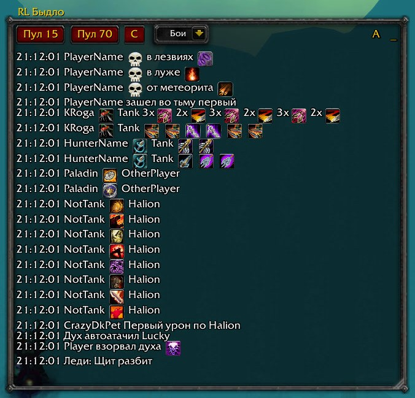

# RL Быдло (Raid Leader Helper)

Аддон для World of Warcraft 3.3.5a, помогающий рейд лидерам управлять рейдом.

## Возможности

- Быстрый доступ к основным функциям рейд лидера
- Настраиваемые правила и штрафы
- Отслеживание нарушений в рейде
- Простой интерфейс для управления

## Установка

1. Скачайте аддон
2. Распакуйте в папку `World of Warcraft/Interface/AddOns`
3. Перезапустите игру

## Использование

- `/rlh` - показать/скрыть главное окно
- `/rlh help` - показать список команд

## Основные функции

### Мониторинг правил
- Отслеживание позиций игроков
- Проверка выполнения механик

## Системные требования

- World of Warcraft 3.3.5a
- Аддон DBM v4
- Права рейд лидера для использования

## Разработка

Аддон использует:
- Lua 5.1
- Ace3 Framework
- WoW API
- EPGP API

## Лицензия

Свободное распространение и модификация

---

TODO:
[]